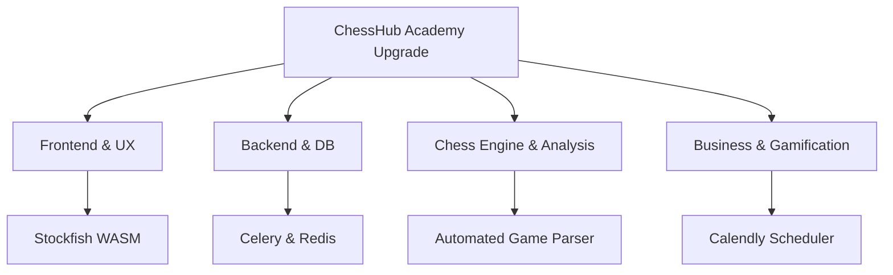
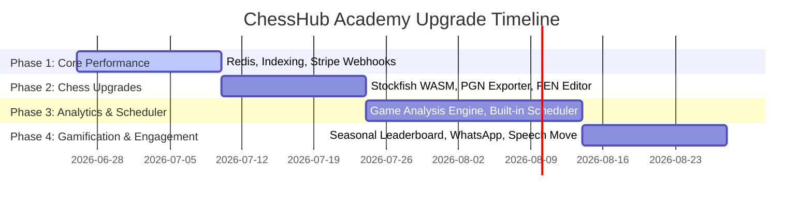

# ChessHub Academy: Full Project Review & 40 Developer Upgrade Suggestions

This document presents a comprehensive review of the ChessHub Academy Online platform from a developer and software architect perspective. The platform features a **Next.js (App Router, TailwindCSS v4, TypeScript)** frontend and a **Django REST Framework (with Daphne/Channels)** backend. It integrates interactive chess logic (`chessground` and `chess.js`), Zoom Meeting SDKs, Google Drive API, and Lichess API scraping.

Below is the technical breakdown of the architecture, followed by **40 unique, highly actionable upgrade ideas** to make this platform a premium, industry-leading chess education portal.

---

## 1. Technical Architecture Overview

### Frontend Stack (`/frontend`)
*   **Framework:** Next.js 16 (React 19, TypeScript) with TailwindCSS v4.
*   **Routing:** Next.js App Router (`/src/app`) containing public marketing pages (such as `/online-chess-classes-for-kids`, `/chess-coaching-for-beginners`) and role-based client dashboards (`/dashboard/student`, `/dashboard/coach`, `/dashboard/parent`, `/dashboard/manager`).
*   **Interactive Chess Elements:** Built with `chessground` (Lichess's open-source board library) and `chess.js` for rules validation, move generation, and FEN parsing.
*   **Virtual Classroom Integration:** Zoom Meeting Web SDK (`@zoom/meetingsdk`) embedded dynamically via React components.
*   **Aesthetics:** Dark-mode glassmorphic theme using custom HSL/HEX CSS variables (defined in `globals.css`) with premium gold accents (`--accent: #d4af37`).

### Backend Stack (`/backend`)
*   **Framework:** Django (4.2+) & Django REST Framework.
*   **Real-time Infrastructure:** Django Channels and Daphne configured for web socket connectivity (currently utilizing an `InMemoryChannelLayer` in dev).
*   **Database:** Configured to support SQLite natively for local dev and PostgreSQL dynamically through environment variables.
*   **Authentication:** JWT-based stateless authentication (`rest_framework_simplejwt`).
*   **Key Modules (`apps/`):**
    *   `authentication`: Custom user model mapping roles (`manager`, `coach`, `student`, `parent`).
    *   `academy`: Core models managing scheduling, booking, class balances, and `StudentPerformanceProfile`.
    *   `classroom`: Handles `LessonPlan`, `BoardState` synchronization, `SessionEvent` history, and `StudyVault`.
    *   `homework`: Assigns and reviews PDFs, PGNs, quizzes, and tactical puzzle sets.
    *   `gamification`: Streak metrics, XP ledger (`XpTransaction`), and digital badges.
    *   `tournaments`: Houses Lichess-backed tournament information.
    *   `integrations`: Contains Zoom signature generation, Google Drive service accounts, and Lichess user data scraping.

---

## 2. 40 Unique Upgrade & Actionable Suggestions

Here are 40 developer suggestions categorized by layer to help scale ChessHub Academy to a premium enterprise-grade platform.

### Category A: Frontend & UX Enhancements (A1 - A10)

1. **WASM-Powered Stockfish Engine (Offline Evaluation):**
   Integrate Stockfish compiled to WebAssembly (WASM) directly into the browser. This allows students to get instant evaluation lines (-1.5, +0.4) on their analysis board without querying a server or consuming external APIs.
2. **Smooth Framer-Motion Piece Animations:**
   Replace basic board updates with smooth transitions and subtle CSS particle effects on piece capture. Introduce slight shakes on blunders and particle explosions on checkmate to elevate game feel.
3. **Interactive PDF Homework Annotator:**
   Instead of forcing students to print/download homework PDFs, display the PDF inside the Next.js app with a canvas layer overlay or embedded board drop-ins. Students can drag chess pieces directly onto the PDF to submit answers.
4. **i18n & Multi-Language Support:**
   Incorporate standard internationalization (`next-intl` or `react-intl`) supporting Hindi, Spanish, Russian, and French, expanding market reach beyond English-speaking countries.
5. **Mobile Progressive Web App (PWA):**
   Configure Next-PWA so students can add ChessHub Academy directly to their mobile/tablet home screen, cache curriculum items, and solve tactical puzzles offline.
6. **Coach "Simul Grid" (Simultaneous Viewer):**
   In group classes, show the coach a grid of all participating students' live chessboards in real time. The coach can monitor all boards at once and drop into any board with a single click to guide individual students.
7. **Accessibility Theme Customizer:**
   Provide custom themes for color-blind users (e.g. blue-yellow boards) and options to adjust chess piece sizes, audio volume for move sounds, and font sizing.
8. **Interactive Replay with Audio Overlay:**
   Record audio files during live sessions and synchronize them with board events (`SessionEvent`). When students click "Replay Class," the board replays moves, arrows, and highlights in sync with the coach's recorded voice.
9. **Next.js Error Boundaries & Sentry Integration:**
   Implement strict Next.js error boundaries with custom fallback UIs and wire up LogRocket/Sentry to capture frontend runtime exceptions and session replays.
10. **Blindfold Chess & Speech-to-Text Moves:**
    Add a training mode where pieces are invisible. Allow students to voice their moves (e.g., "Knight to f3") using the Web Speech API or type them in algebraic notation (Nf3) to test visualization skills.

---

### Category B: Backend & Database Architecture (B1 - B10)

11. **Production-Ready Redis Channel Layer:**
    Replace Django Channels' default `InMemoryChannelLayer` with a Redis backend (`channels-redis`) to support scaling across multiple Daphne web instances in production.
12. **Celery & Redis Task Queue for Integrations:**
    Move heavy processes—such as fetching Lichess profiles, syncing Zoom recordings, and generating PDF reports—to asynchronous Celery background tasks to keep API response times under 100ms.
13. **Comprehensive REST Framework Pagination & Throttling:**
    Implement role-based rate limiting (e.g., stricter throttling for anonymous leads booking demos, higher limits for students taking tests) to prevent API abuse.
14. **Database Performance Indexing:**
    Apply database indexes on fields commonly filtered or sorted, such as `scheduled_start` on `Session`, `student` on `HomeworkAssignment`, and `status` on `DemoBooking`.
15. **Stripe & PayPal Webhook Integration:**
    Add an automated billing callback view to listen for Stripe/Razorpay payment events. When a parent completes a payment, automatically increase the student's `session_balance` field and generate an invoice.
16. **PostgreSQL pg_trgm & Full-Text Search on Study Vault:**
    Enable full-text search across PGN commentary, tags, and chapter titles in `StudyVault` utilizing Django's native PostgreSQL search filters.
17. **JWT Token Rotation & Secure HttpOnly Cookies:**
    Switch from storing JWT access tokens in browser local storage (susceptible to XSS) to secure `HttpOnly`, `SameSite=Strict`, `Secure` cookies.
18. **Structured System Audit Logging:**
    Introduce an audit trail table to log database modifications, particularly around class credit balances (e.g., tracking who adjusted a balance, when, and the reason).
19. **Automated WhatsApp Booking Confirmations:**
    Connect a WhatsApp API service (like Twilio or Meta API) to automatically ping parents when a demo is booked, when a class is rescheduled, or when monthly reports are ready.
20. **Security Middleware & CORS Hardening:**
    Configure strict Django security headers (HSTS, Content Security Policy, X-Content-Type-Options) and whitelist specific frontend domains instead of using `CORS_ALLOW_ALL_ORIGINS = True`.

---

### Category C: Chess Logic & Automated Analysis (C1 - C10)

21. **Automated Game Analysis Engine:**
    Analyze PGN logs from finished student games against Stockfish on the server. Generate metrics like Average Centipawn Loss (ACPL), blunder counts, and mistake percentages to update `StudentPerformanceProfile` automatically.
22. **Personalized Tactical Puzzle Generation:**
    Generate puzzles based on a student's actual blunders in past games. If the analysis engine identifies a missed tactical opportunity, isolate the position, turn it into a puzzle, and assign it as custom homework.
23. **Opening Explorer Integration:**
    Integrate the Lichess Opening Explorer API. During studies or analysis, display statistics showing how often master-level games play a particular move and what the win/draw ratios are.
24. **Interactive Position Editor with FEN Validator:**
    Upgrade the analysis board to support setting up positions manually. Include drag-and-drop piece placing, active side selection (White/Black), castling rights toggles, and instant FEN validation.
25. **PGN Exporter & Downloader:**
    Provide a button for coaches and students to export custom studies or classroom board session logs as cleanly formatted `.pgn` files, complete with game annotations.
26. **Automated FEN-from-Image OCR Parser:**
    Allow students to upload a screenshot of a chessboard (e.g., from a book or a separate site). Use a lightweight machine learning parser (like TensorFlow.js or a Python board-state parser) to translate it to FEN and load it on the screen.
27. **Spaced Repetition Opening Trainer:**
    Implement spaced repetition (like Anki) for opening lines. Prompt students to replay specific variations after 1, 3, 7, and 30 days to reinforce opening preparation.
28. **Endgame Tablebase Explorer:**
    For positions with 7 or fewer pieces, connect to the Lomonosov/Syzygy Endgame Tablebases to show absolute win/draw evaluations and perfect moves.
29. **Lichess OAuth2 Single Sign-On (SSO):**
    Allow students and coaches to authenticate directly via Lichess OAuth. This eliminates manual username typos and allows the platform to fetch game histories securely.
30. **Interactive Quiz Creator for Coaches:**
    Enable coaches to compile move-based quizzes. If a student makes the incorrect move, display pre-written feedback from the coach explaining the tactical flaw.

---

## 3. Business Logic, Gamification, & Student Growth (D1 - D10)

31. **Interactive Scheduler (Calendly Alternative):**
    Build a built-in calendar scheduling module. Coaches configure their weekly working hours, and students/parents can book or reschedule 1-to-1 classes based on real-time availability.
32. **Seasonal Leaderboards & Elo Divisions:**
    Refine the gamification system by introducing seasonal resets (monthly or quarterly) and divisions (Bronze, Silver, Gold, Master) based on points earned from puzzles and homework.
33. **Parent Billing & Class Credit Ledger Dashboard:**
    Build a transparent parental billing dashboard detailing invoices, transactions, classes booked, classes remaining, and clear attendance histories.
34. **Bulk Puzzle & Curriculum CSV Importer:**
    Provide an admin interface for managers to upload puzzles or curriculum paths in bulk using standard CSV or JSON files.
35. **Daily Challenge System:**
    Keep students engaged daily by introducing daily challenges (e.g., "Solve 5 tactical puzzles," "Learn 1 opening step," or "Play 1 rapid game"). Reward completion with streaks, XP, and gold badges.
36. **WebRTC P2P Video Backup:**
    Implement a WebRTC fallback inside the platform (using MediaSoup or simple peer-to-peer connections) to serve as a video/audio backup in case the Zoom API fails or experiences downtime.
37. **AI Coach Report Generation Enhancement:**
    Instead of using placeholder text, use a local LLM or OpenAI API to analyze classroom events (`SessionEvent`) and draft personalized coach feedback summaries automatically.
38. **Interactive Certificate Generator:**
    Generate high-resolution certified PDFs when a student completes a curriculum block (e.g. "Beginner Foundations Complete"). Allow students to download it or share it on social media.
39. **Custom Badge Designer for Coaches:**
    Allow coaches to create custom achievements (e.g. "Tactical Wizard", "Resilient Defender") with custom icons and assign them to students along with XP bonuses.
40. **AI Voice-Over for Kids' Lessons:**
    Incorporate text-to-speech functionality for younger students. The app can read aloud lesson explanations and step-by-step guides, helping them learn autonomously.

---

## 4. Recommended Implementation Roadmap

For rapid and structured development, the upgrades can be rolled out in four phases:

### Next Steps for Implementation:
1. **Transition the database** configuration to PostgreSQL globally to prepare for search indexing and Celery integration.
2. **Implement Redis** for Django Channels to ensure real-time socket sessions are robust and scale-ready.
3. **Embed Stockfish WASM** on the client side to immediately enhance user interactivity during analysis.
